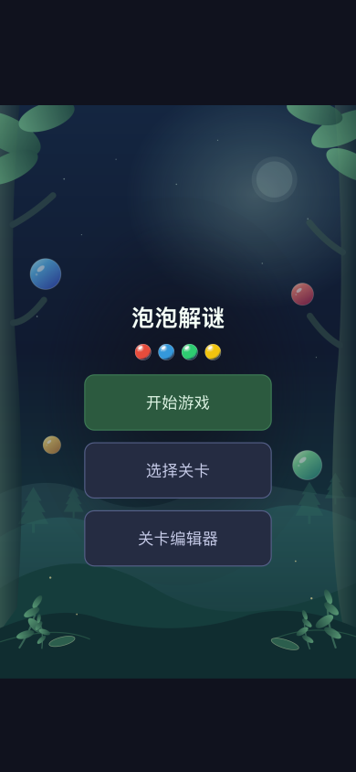
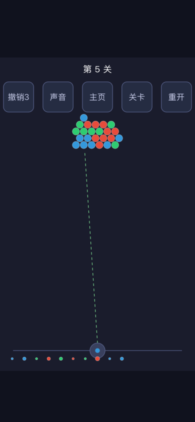

# Bubble Sort / Bubble Block

**围绕颜色消除、有限弹药与关卡创作的 HTML5 游戏原型。**

[在线试玩 · V1.7](https://Norman0721.github.io/bubble-sort-puzzle/) · [关卡编辑器 · V1.10](https://Norman0721.github.io/bubble-sort-puzzle/editor.html) · [设计案例](docs/PORTFOLIO.md)

本项目展示从可玩原型到关卡制作工具的迭代过程：蜂窝棋盘、弹药配置、隐藏球、成对变色球，以及适配手机的操作流程。项目通过 AI 辅助实现与迭代，源码、测试和版本记录一并保留，方便查看设计如何落地。

## 画面与交互设计

下图为项目中的界面设计稿，不是运行截图。

 

## 体验方式

- **直接试玩**：V1.7 含 50 个内置关卡，进入首页后点击开始游戏。使用鼠标或触屏瞄准，松开发射。
- **关卡创作**：V1.10 为独立的空白关卡库。进入编辑器绘制棋盘，再配置弹药、验证并试玩。
- **离线打开**：下载对应版本 HTML 后用浏览器打开，无需安装依赖。

编辑器数据保存在当前浏览器的 localStorage。线上与本地文件的数据不会自动同步；重要关卡请导出 JSON 保存。

## 设计重点

| 系统 | 设计与实现 |
| --- | --- |
| 有限弹药 | 通过颜色、容量、反弹类型与发射顺序形成决策约束 |
| 隐藏球 | 根据六方向邻接占据状态揭示真实颜色，增加信息变化 |
| 成对变色球 | 每次射击结算后交换颜色；一方移除后另一方锁定 |
| 关卡编辑器 | 绘制、框选、批量修改、撤销重做、校验与即时试玩 |
| 弹药队列工具 | 多选、拖动排序和批量配置，支持独立保存 |
| 手机操作 | 扩大触控区域、取消瞄准提示、安全区适配和离开确认 |

## 本地开发

使用 Python 3 构建，Node.js 内置测试运行器执行测试：

```sh
node --test tests/*.test.js
python3 editor/build.py --blank-levels --output "Bubble Sort Preview.html"
```

构建结果为包含素材和脚本的单文件 HTML。源码采用 JavaScript、HTML、CSS，游戏基线包含 Phaser 引擎。

- `editor/`：关卡和弹药编辑器、构建脚本、游戏基线
- `game/`：玩法扩展、移动端逻辑、审计及设计稿
- `home/`：首页交互与素材
- `tests/`：自动化测试
- `docs/`：GitHub Pages 试玩、编辑器与作品集说明
- `Bubble Sort Mobile V*.html`：保留的历史版本

## 验证与边界

当前运行 **93 项自动化测试，全部通过**。测试覆盖编辑器状态、保存恢复、玩法桥接、隐藏球与变色球等逻辑。历史流程审计覆盖 50 个内置关卡；贪心策略通过其中 25 关，其余走到弹药耗尽，不能据此宣称所有关卡均已证明可解。模拟环境测试不替代手机真机手感与性能验收。

## 版本选择

V1.7 用于开箱即玩的作品演示；V1.8–V1.10 专注从零创建关卡，采用独立存储。最新编辑器 V1.10 保留空白关卡模式。移动端设计与验证见 [移动端说明](game/MOBILE.md)。

本仓库用于作品展示，暂未授予项目整体的开源许可；第三方组件遵循其各自许可。
